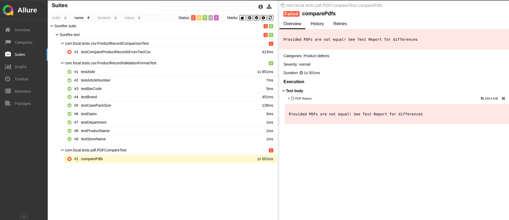

# Focal Report Regression Testing Framework

This framework is designed to automate the validation of these reports by applying a set of rules to check for data integrity and highlight any regressions.

My assumption was that the production data are the "source of truth".

## Table of Contents

- [Goal](#goal)
- [Project Overview](#project-overview)
- [Dependencies](#dependencies)
- [Getting Started](#getting-started)
- [Running the Tests](#running-the-tests)
- [Validation Rules](#validation-rules)
- [Test Quality Improvements](#test-quality-improvements)

---

## Goal

The goal of this framework is to automate regression testing for Focal's reports in both CSV and PDF formats. 
The source of truth is production data. The tests will identify any discrepancies to ensure data integrity and consistency before deploying changes.

## Project Overview

The framework leverages the following technologies and tools:
- **Java 17**: As main programming language.
- **TestNG**: Test orchestration and execution.
- **AssertJ**: Fluent assertions for data verification.
- **Allure**: Test reporting.
- **PDFCompare**: PDF comparison.
- **OpenCSV**: CSV parsing and handling.

## Dependencies

The project is configured with Maven and uses the following dependencies for specific functionalities:

- **TestNG**: Testing framework for running and organizing tests.
- **AssertJ**: For fluent assertion statements.
- **Lombok**: Reduces boilerplate code.
- **OpenCSV**: Reads and writes CSV data for validation.
- **PDFCompare**: Compares PDF content for detecting changes.
- **Allure**: Generates test reports.

## Getting Started

### Prerequisites

- **Java 17 or higher**: Ensure JDK 17 or higher is installed.
- **Maven 3.9.9**: Required to build and manage dependencies.
- **GNU Make 4.3**: As commands aggregator for fast and easy use 
- **Linux/Ubuntu 24.04 LTS** - As main execution platform

### Installation

1. Install Java, Maven, Make on any Linux distribution preferably Ubuntu

2. Clone the repository:

   ```bash
   git clone git@github.com:ilusi0npl/focal-test.git  
   cd focal-report-regression
   ```

3. Run all tests

   ```bash
   make build-test-project
   ```

## Running the Tests


#### 1. run-all-tests
• Runs all tests in the project, clearing any previous build artifacts before executing the test suite.  
• Command:
  ```bash
  make run-all-tests
  ```

#### 2. run-csv-tests-files
• Runs only the CSV comparison tests.  
• Uses `ProductRecordComparisonTest` to compare the production and staging CSV files by passing file paths as properties.  
• Command:
  ```bash
  make run-csv-tests-files
  ```

#### 3. run-pdf-comparison-tests
• Executes only the PDF comparison tests.  
• Runs the `PDFCompareTest` class to verify that production and staging PDFs match.  
• Command:
  ```bash
  make run-pdf-comparison-tests
  ```

#### 4. run-validation-format-tests-production
• Runs the `ProductRecordValidationFormatTest` on the production CSV file to validate format compliance.  
• The production file path is passed as a property.  
• Command:
  ```bash
  make run-validation-format-tests-production
  ```

#### 5. run-validation-format-tests-staging
• Runs the `ProductRecordValidationFormatTest` on the staging CSV file to validate format compliance.  
• The staging file path is passed as a property.  
• Command:
  ```bash
  make run-validation-format-tests-staging
  ```

## Test Report generation

To generate test report execute:

  ```bash
  make generate-test-report
  ```

Report should automatically pop up in your default browser.

Example screenshot below



## Current test results

- There are discrepancies both in CSV and PDF

For CSV:

- Staging data does not follow the same validation rules as production data. Run `make run-validation-format-tests-staging` to see details
- Comparison 1-to-1 for between staging and production also fails. Results does not match. Run `make run-all-tests` and see `testCompareProductRecordsFromTwoCsv` test results


For PDF:

- From a structural point of view there are two different files
- From content type of view data is shifted probably due to `'` See [pdf-result.pdf](test-report-example/pdf-result.pdf)


# Validation Rules Documentation for CSV

### Field-Level Validation Rules (CSV)

- **General Field Requirements**
   - Fields such as `Store Name`, `Product Name`, and `Department` should be non-null and non-empty.

- **Unique Identifier Format**
   - Unique identifiers, such as `Barcode`, should:
      - Be non-null and non-empty.
      - Follow a specific pattern (e.g., `Barcode` might start with a character and contain a set number of digits).

- **Number Formatting**
   - Numeric fields like `Case Pack Size` or `Stock Levels` should:
      - Be non-null and positive.
      - Meet specific constraints, such as being even or falling within a logical range.

- **Text Format**
   - Text fields, such as `Aisle` or `Article Number`, should:
      - Follow a specific format (e.g., two letters followed by two digits for `Aisle`).
      - Have a consistent length if specified.

- **Date and Time Format**
   - Date fields, like `Marked At` or `Last Received Date`, should:
      - Be in a standardized format (e.g., `yyyy-MM-dd HH:mm:ss`).
      - Ensure logical consistency if multiple dates are related (e.g., `Last Received Date` should not be after `Marked At`).

### Record-Level Validation Rules (CSV)

- **Record Count Check**
   - Ensure that both production and staging data files contain the same number of records.

- **Field-by-Field Record Comparison**
   - Each field in staging records should match the corresponding field in production records to detect any inconsistencies.

### Future checks for CSV files which should be implemented

- **Value Range Constraints**
   - Fields like `Stock Ratio` or `Case Pack Size` should stay within a specified range based on logical or business rules.

- **Predefined Value Sets**
   - Fields like `Status` or `Availability` should only contain predefined, expected values (e.g., "In Stock", "Out of Stock").

- **Data Cleanliness**
   - Text fields such as `Product Name`, `Brand`, and `Store Name` should not have leading/trailing spaces or special characters unless allowed.

- **Cross-Field Consistency**
   - Ensure logical consistency between fields, such as alignment between `Department` and `Product Category`.

- **Error Handling Scenarios**
   - Test handling of missing, null, or malformed values in essential fields to confirm the system manages errors gracefully.

Generally also we have to implement stricter validation of data types, such as integer or decimal fields, to catch subtle format changes or type mismatches.


# Validation Rules Documentation for PDF

The `PDFCompareTest` class, which aims to ensure that production and staging PDFs are identical in content and structure.
Due to Java's limited free libraries for detailed PDF validation current approach only check report in pixel-by-pixel manner.
Current approach is not enough.

---

### PDF Comparison Validation Rules

- **Structural and Content Equality**
    - **Match in Page Count**: Ensure both PDFs have the same number of pages.
    - **Text and Element Positioning**: Validate that text elements and graphical elements are positioned identically on both PDFs.
    - **Font and Style Consistency**: Confirm that fonts, styles, and other text formatting are consistent across both files.

---

### Limitations of PDF Comparison in Java

Java has limited support for robust, free PDF comparison tools, which restricts thorough PDF content validation. 
Current libraries may not reliably detect graphical discrepancies or slight textual variations, particularly in complex or image-heavy PDFs.
There are solution on the market which are much better, but are paid solutions.

---

### Suggested Enhancements

To improve accuracy and consistency in PDF validation, consider the following enhancements:

- **OCR Integration**
    - **Text Extraction for Image-Based PDFs**: Integrate an Optical Character Recognition (OCR) tool to read and validate text from graphical content, ensuring even image-based text is verified.
    - **Enhanced Text Comparison**: OCR can help recognize and validate text content that traditional PDF comparison tools might miss, particularly beneficial for PDFs that include images of text or complex layouts.

- **Adoption of CSV Validation Rules for PDFs**
    - **Apply Similar Rules**: Where possible, implement the same validation rules as those for CSV files, ensuring that fields such as product names, identifiers, and other essential details are consistent in content and format across production and staging.
    - **Structured Data Consistency**: Ensure that key structured data (e.g., headers, table contents) matches in both content and positioning across PDFs.

